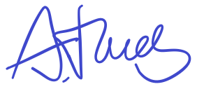

### Erklärung:

Ich versichere, dass ich die Projektarbeit ohne Hilfe Dritter und ohne Benutzung anderer als der angegebenen Quellen und Hilfsmittel angefertigt habe. Die den benutzten Quellen wörtlich oder inhaltlich entnommenen Inhalte sind als solche kenntlich gemacht.
Ich erteile hiermit der TH Deggendorf das Recht, die von mir erstellte Software für hochschulinterne Zwecke verwenden zu dürfen.

**Ort, Datum:** Deggendorf, 08.01.2026

**Unterschrift:**

