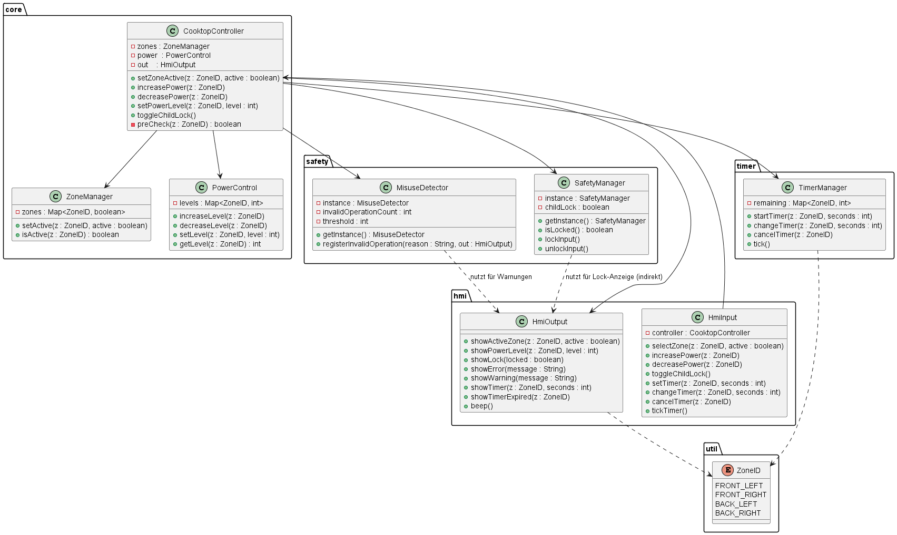
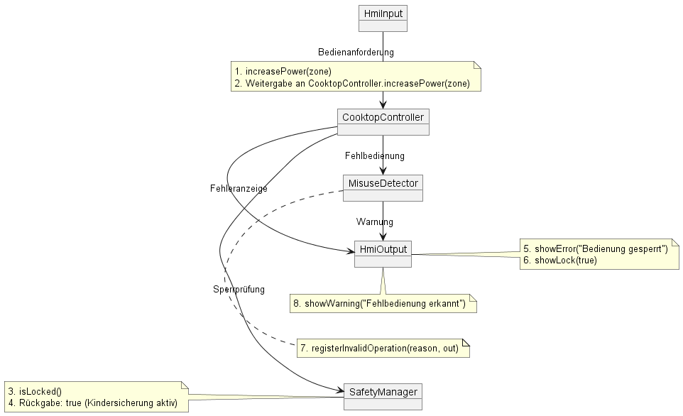
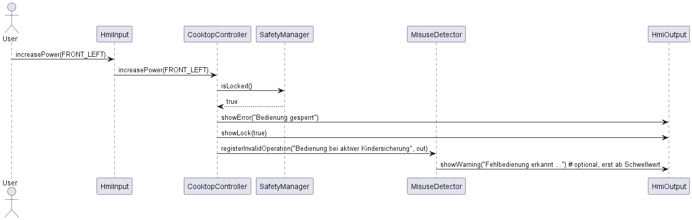

# Sprint 3 – Kochfeldsteuerung

## Ziel des Sprints

Sprint 3 erweitert die Kochfeldsteuerung um die **Erkennung von Fehlbedienungen** und die **Ausgabe von Warnungen**.  
Im Fokus stehen:

- das Erkennen wiederholter ungültiger Benutzereingaben (z. B. Bedienen gesperrter oder inaktiver Zonen),
- die Ausgabe verständlicher Warnmeldungen auf der Anzeige,
- die Sicherstellung, dass bestehende Funktionen aus Sprint 1 und 2 unverändert korrekt weiterlaufen (Regression).

Der Benutzer soll bei wiederholten Fehlbedienungen klare Rückmeldungen erhalten, ohne dass die Stabilität der Basisfunktionen (Leistungsregelung, Timer, Kindersicherung) beeinträchtigt wird.

---

## Scope Sprint 3 (Requirements)

Folgende Requirements aus der Traceability-Matrix werden in Sprint 3 adressiert:

**Funktionale Anforderungen**

- **F-08**: Fehler- oder Sperrzustände anzeigen (wird um Fehlbedienungswarnungen ergänzt)  
- **F-14**: Fehlbedienungserkennung & Warnung  

**Nicht-funktionale Anforderungen**

- **NF-02**: Keine ungewollte Aktivierung/Deaktivierung  
- **NF-03**: Schutz gegen unbeabsichtigte Eingaben  

Die Zuordnung zu den Software-Design-Komponenten ist in der [Traceability-Matrix](../Traceability-Matrix.md) dokumentiert.  
Sprint 3 ergänzt dort insbesondere die Testabdeckung von **F-14**, sowie die Querverbindung zu **NF-02/NF-03**.

---

## Software-Design-Komponenten Sprint 3

Im Vergleich zu Sprint 2 werden keine ganz neuen Komponenten eingeführt, sondern bestehende Klassen erweitert:

- **cooktopController** (erweitert)  
  - bleibt zentrale Steuerinstanz für Zonen, Leistung und Timer  
  - führt einen **Fehlbedienungszähler pro Zone**  
  - registriert ungültige Eingaben (z. B. Bedienung bei aktiver Kindersicherung oder inaktiver Zone)  
  - löst ab einem Schwellwert (z. B. mehrfachen Fehlversuchen) eine Warnmeldung aus (`showWarning(...)`)

- **hmiOutput** (erweitert)  
  - erhält eine zusätzliche Methode `showWarning(String message)`  
  - kann neben Fehlern und Statusinformationen nun auch **Warnungen** bei Fehlbedienung ausgeben  
  - bleibt zentrale Schnittstelle für alle Benutzerrückmeldungen (Status, Timer, Fehlermeldung, Warnung, Beep)

- **SafetyManager** (unverändert in der Struktur, aber intensiver genutzt)  
  - liefert weiterhin den Sperrstatus (Kindersicherung)  
  - wird vom Controller verwendet, um Eingaben bei Sperre als Fehlbedienung zu klassifizieren

- **ZoneManager / PowerControl / TimerManager** (unverändert)  
  - bleiben für Zonenstatus, Leistungsstufen und Timerverwaltung zuständig  
  - dienen jetzt zusätzlich als Kontext, in dem Fehlbedienungen erkannt werden (z. B. Leistungsänderung an inaktiver Zone)

- **HmiInput** (unverändert)  
  - repräsentiert weiterhin die HMI-Eingaben (Zonenwahl, Leistungsänderung, Timeroperationen, Kindersicherung)  
  - die Erkennung der Fehlbedienung erfolgt bewusst im `CooktopController`, nicht in `HmiInput`

---

## UML-Diagramme Sprint 3

Die UML-Diagramme für Sprint 3 liegen im Ordner `docs/Sprint 3/UML-Diagramme/` und wurden mit PlantUML erzeugt.

**Klassendiagramm – Sprint 3**  

- zeigt die erweiterten Methoden von `CooktopController` und `HmiOutput`  
- visualisiert den internen Fehlbedienungszähler im `CooktopController`  
- macht sichtbar, dass die grundlegende Architektur aus Sprint 1 / 2 beibehalten wurde

**Kommunikationsdiagramm – Fehlbedienung**  

- stellt die Interaktion bei wiederholter Fehlbedienung dar  
  (z. B. Benutzer versucht mehrfach, eine gesperrte Zone zu bedienen)  
- zeigt den Weg von der Eingabe (`HmiInput`) über den `CooktopController` hin zu `HmiOutput.showError(...)` und `showWarning(...)`

**Sequenzdiagramm – Use Case „Wiederholte Fehlbedienung“**  

- beschreibt den Ablauf mehrerer ungültiger Eingaben hintereinander  
- zeigt, wie der Fehlbedienungszähler im `CooktopController` erhöht wird  
- illustriert, ab wann eine Warnung angezeigt wird (Schwellwert)

Die Diagramme erweitern konsistent die in Sprint 1 und 2 eingeführte Architektur und fokussieren sich auf die neue Funktion **Fehlbedienungserkennung & Warnung (F-14)**.

---

# Testfälle – Sprint 3

## 1. Zielsetzung der Testaktivitäten

In **Sprint 3** wurde die Kochfeldsteuerung um eine Logik zur Erkennung von Fehlbedienungen erweitert.  
Die Testaktivitäten verfolgen folgende Ziele:

- Nachweis, dass **ungültige Eingaben korrekt erkannt und gezählt** werden,  
- Nachweis, dass **ab einem definierten Schwellwert** eine Warnmeldung ausgegeben wird,  
- Sicherstellung, dass bestehende Funktionen aus Sprint 1 und 2 (Timer, Zonensteuerung, Kindersicherung) **nicht negativ beeinflusst** werden (Regression).

Es werden wie bisher zwei Ebenen betrachtet:

- **Modulebene**: Fokus auf den `CooktopController` (Fehlbedienungszähler, interne Logik)  
- **Integrationsebene**: Zusammenspiel von `HmiInput`, `CooktopController` und `HmiOutput` bei Fehlbedienungen

---

## 2. Testfälle auf Modulebene

Auf Modulebene steht die neue Fehlbedienungslogik im `CooktopController` im Vordergrund.  
Die Tests greifen direkt auf Controller-Methoden zu (ohne HMI), um die Zähler- und Resetlogik isoliert zu prüfen.

[📄 Testfälle – Modulebene](../../Testfälle/Testfälle_Modulebene.md)

Die neuen Testfälle für Sprint 3 sind:

| Test-ID | Modul                    | Zweck                                                   |
|--------:|--------------------------|---------------------------------------------------------|
| MT-07   | core (CooktopController) | Zählung mehrerer Fehlbedienungen an einer Zone         |
| MT-08   | core (CooktopController) | Rücksetzen des Fehlbedienungszählers nach gültiger Eingabe |

Kurzbeschreibung:

- **MT-07 – Fehlbedienung zählen**  
  - Mehrfach ungültige Aktionen (z. B. Leistungsänderung bei inaktiver Zone oder bei aktiver Kindersicherung) werden ausgelöst.  
  - Erwartung: Der interne Zähler wird pro Fehlversuch erhöht; ab Erreichen des Schwellwertes wird eine Warnung ausgelöst.

- **MT-08 – Zähler zurücksetzen**  
  - Nach einem oder mehreren Fehlversuchen wird eine gültige Aktion ausgeführt (z. B. Zone korrekt aktivieren und Leistungsstufe ändern).  
  - Erwartung: Der Fehlbedienungszähler für diese Zone wird zurückgesetzt, weitere gültige Eingaben erzeugen keine Warnungen.

---

## 3. Testfälle auf Integrationsebene

Auf Integrationsebene wird geprüft, ob Fehlbedienungen über die HMI-Eingaben ausgelöst, vom Controller erkannt und über `HmiOutput` korrekt gemeldet werden.

[📄 Testfälle – Integrationsebene](../../Testfälle/Testfälle_Integrationsebene.md)

Die neuen Integrationstests für Sprint 3 sind:

| Test-ID | Komponenten                                      | Zielsetzung                                                   |
|--------:|--------------------------------------------------|----------------------------------------------------------------|
| IT-10   | HmiInput ↔ CooktopController ↔ HmiOutput         | Fehlbedienung bei aktiver Kindersicherung (Sperrzustand)      |
| IT-11   | HmiInput ↔ CooktopController ↔ HmiOutput         | Wiederholte Fehlbedienung an inaktiver Zone mit Warnung       |

Kurzbeschreibung:

- **IT-10 – Fehlbedienung bei aktiver Kindersicherung**  
  - Kindersicherung wird über HMI aktiviert.  
  - Anschließend werden wiederholt Eingaben ausgeführt (z. B. Zone aktivieren, Leistung ändern).  
  - Erwartung:  
    - `HmiOutput.showError("Bedienung gesperrt")` wird aufgerufen.  
    - Ab mehreren Fehlversuchen wird zusätzlich `HmiOutput.showWarning(...)` ausgegeben.

- **IT-11 – Fehlbedienung an inaktiver Zone**  
  - Zone bleibt inaktiv, es werden aber wiederholt Leistungsänderungen über HMI versucht.  
  - Erwartung:  
    - Fehlermeldung „Zone nicht aktiv“ über `showError(...)`.  
    - Nach mehreren Fehlversuchen Warnmeldung über `showWarning(...)`.  
    - Sobald die Zone korrekt aktiviert wird, werden weitere Eingaben als gültig behandelt und der Zähler zurückgesetzt.

Damit wird sichergestellt, dass die Fehlbedienungserkennung aus Benutzersicht nachvollziehbar und konsistent ist.

---

## 4. Bezug zur Traceability-Matrix

Die neuen Testfälle aus Sprint 3 sind in der  
[Traceability-Matrix](../Traceability-Matrix.md) mit den entsprechenden Requirements verknüpft.

**Anforderungsauszug (Sprint 3-Relevanz)**

| Requirement | Inhalt                                   | Abgedeckt durch              |
|------------|-------------------------------------------|------------------------------|
| F-08       | Fehler-/Sperrzustände anzeigen            | MT-07, IT-10                 |
| F-14       | Fehlbedienungserkennung & Warnung         | MT-07, MT-08, IT-10, IT-11   |
| NF-02      | Keine ungewollte Aktivierung/Deaktivierung | MT-07, IT-10, IT-11          |
| NF-03      | Schutz gegen unbeabsichtigte Eingaben      | MT-07, MT-08, IT-10, IT-11   |

Damit ist dokumentiert, wie die neue Fehlbedienungslogik die übergeordneten Qualitätsziele unterstützt.

---

## 5. Durchgeführte Testläufe und Dokumentation der Ergebnisse

Zur Verifikation der in **Sprint 3** implementierten Fehlbedienungserkennung wurde ein eigener Testdurchlauf durchgeführt.  
Die neuen Testfälle auf **Modulebene** (MT-07, MT-08) und **Integrationsebene** (IT-10, IT-11) wurden ausgeführt.  
Zusätzlich wurden die Tests aus **Sprint 1** (`Test_Sprint1.java`) und **Sprint 2** (`Test_Sprint2.java`) erneut genutzt, um Regressionen auszuschließen.

Die Testausführung für Sprint 3 erfolgt über die Datei  
[`Test_Sprint3.java`](../../tests/Test_Sprint3.java), welche

- gezielt **Fehlbedienungsszenarien erzeugt**,  
- die **Ausgaben von HmiOutput (Fehler/Warnungen)** in der Konsole sichtbar macht,  
- die **Reaktionen des Controllers auf gültige und ungültige Eingaben** strukturiert dokumentiert.

Die Konsolenausgaben wurden mit den definieren Erwartungen aus den Testfalldefinitionen abgeglichen.  
Alle Testfälle wurden im Rahmen der manuellen Sichtprüfung als **bestanden** bewertet.  
Die vorherigen Funktionalitäten aus Sprint 1 und 2 blieben unverändert funktionsfähig.

---

## 6. Vergleich von Architektur/Design und Implementierung (Sprint 3)

Die geplante Erweiterung um Fehlbedienungserkennung wurde mit der konkreten Implementierung verglichen.

### Übereinstimmungen

- Die Erkennung von Fehlbedienungen wurde wie geplant **zentral im `CooktopController`** realisiert.  
- Es wird **kein zusätzlicher Dienst/Subsystem** eingeführt, sondern die Logik ist eng an die bestehende Steuerung gekoppelt.  
- `HmiOutput` wurde um eine **spezifische Warn-API** (`showWarning(String)`) erweitert, wie im Design vorgesehen.  
- Die bestehende Schichtenarchitektur (HMI → Controller → Module) wird beibehalten; HMI erzeugt nur Eingaben, die Auswertung erfolgt im Controller.

### Konkretisierungen / Designentscheidungen

- Die ursprünglich denkbare separate Komponente (z. B. `MisuseDetector`) wurde zugunsten einer **vereinfachten Lösung im `CooktopController`** nicht eingeführt.  
  - Vorteil: weniger Komplexität, direkter Zugriff auf Zustände und Ergebnisse.  
  - Nachteil: Fehlbedienungslogik ist mit der Steuerlogik gekoppelt, später ggf. auslagerbar.

- Die Fehlbedienungserkennung arbeitet mit einem **einfachen Zähler pro Zone** und einem Schwellwert (z. B. ab 3 Fehlversuchen).  
  - Dies wurde bewusst einfach gehalten, da die Übung den Fokus auf Nachvollziehbarkeit und Traceability legt, nicht auf komplexe Heuristiken.

Insgesamt bleibt die Implementierung im Rahmen der geplanten Architektur und ergänzt diese um eine klar abgegrenzte Verantwortung: **Erkennen und Melden von Fehlbedienungen**.

---

## 7. Erkenntnisse aus Sprint 3 (Retrospektive)

### 7.1 Positiv aufgefallene Punkte

- **Erweiterbarkeit der bestehenden Architektur**  
  Die bereits in Sprint 1 und 2 etablierte Struktur konnte ohne Bruch um Fehlbedienungslogik ergänzt werden.  
  Der `CooktopController` ist weiterhin der zentrale Ort für Steuerungsentscheidungen.

- **Klarere Rückmeldungen an den Benutzer**  
  Durch die Trennung von `showError(...)` (konkreter Fehler) und `showWarning(...)` (Hinweis auf wiederholte Fehlbedienungen) wird das Verhalten für den Benutzer transparenter.

- **Regressionstests über mehrere Sprints**  
  Das erneute Ausführen der Tests aus Sprint 1 und 2 hat gezeigt, dass neue Funktionen ohne Seiteneffekte integriert werden können, wenn die Traceability und Teststruktur konsequent gepflegt wird.

### 7.2 Herausforderungen und Verbesserungspotenziale

- **Manuelle Auswertung weiterhin notwendig**  
  Auch für Sprint 3 basieren viele Bewertungen auf Konsolenausgaben, insbesondere für Warnmeldungen.  
  Dies ist auf Dauer aufwendig und anfällig für Übersehfehler.

- **Fehlbedienungslogik aktuell relativ einfach**  
  Die Erkennung basiert lediglich auf Zählerständen und einfachen Bedingungen (gesperrt, Zone inaktiv).  
  In einem realen Produkt wären differenziertere Regeln und konfigurierbare Schwellwerte sinnvoll.

### 7.3 Konsequenzen für zukünftige Erweiterungen

- **Schrittweise Umstellung auf automatisierte Tests**  
  - Mittelfristig sollten die Testfälle aus den drei Sprints in ein automatisiertes Test-Framework (z. B. JUnit) überführt werden.  
  - Das reduziert den manuellen Aufwand und erleichtert Regressionstests.

- **Optionale Auslagerung der Fehlbedienungslogik**  
  - Bei wachsender Komplexität könnte die Logik aus dem `CooktopController` in eine eigene Komponente (z. B. `MisuseDetector`) ausgelagert werden.  
  - Die aktuelle Implementierung bildet dafür eine erste, klar abgegrenzte Basis.

- **Weiterführung der Traceability**  
  - Die positive Erfahrung mit der Traceability-Matrix und den Sprint-Dokumentationen bestätigt den gewählten Ansatz.  
  - Auch zukünftige Erweiterungen sollten konsequent über Requirements, Design, Implementierung und Tests nachverfolgt werden.

Diese Ergebnisse schließen die Arbeiten an **Sprint 3** ab und bilden den Endstand der Kochfeldsteuerung für das Projekt.
